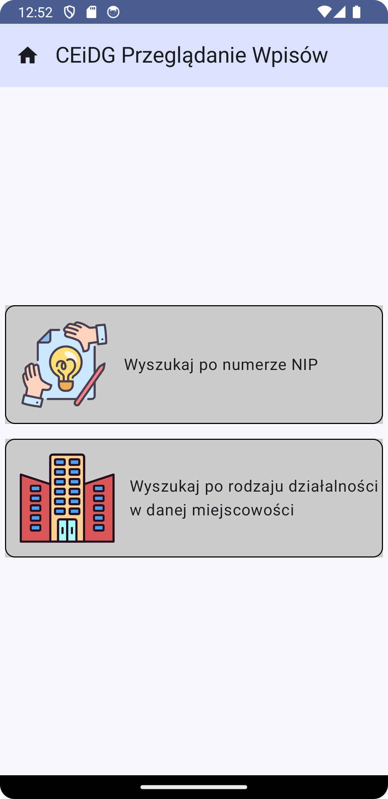
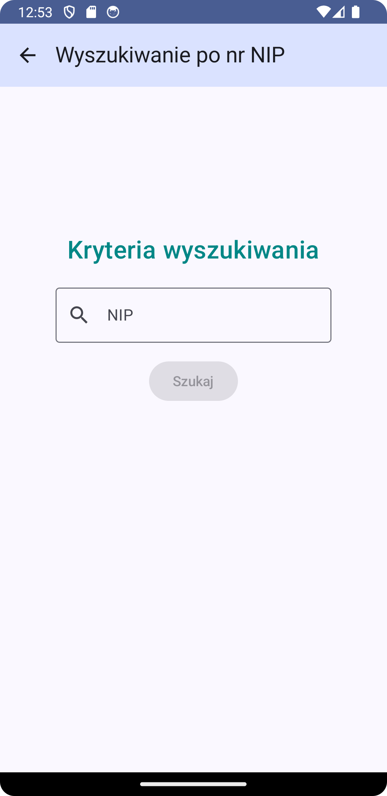
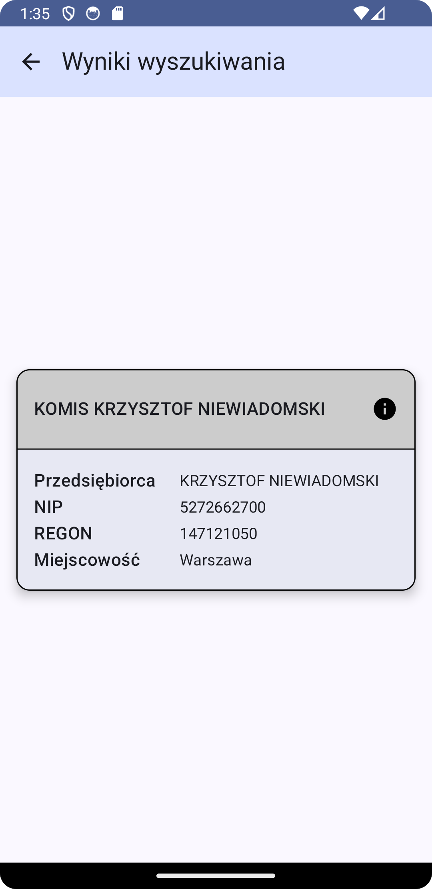
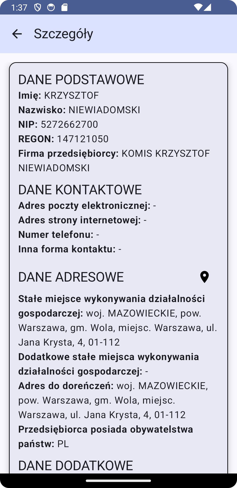
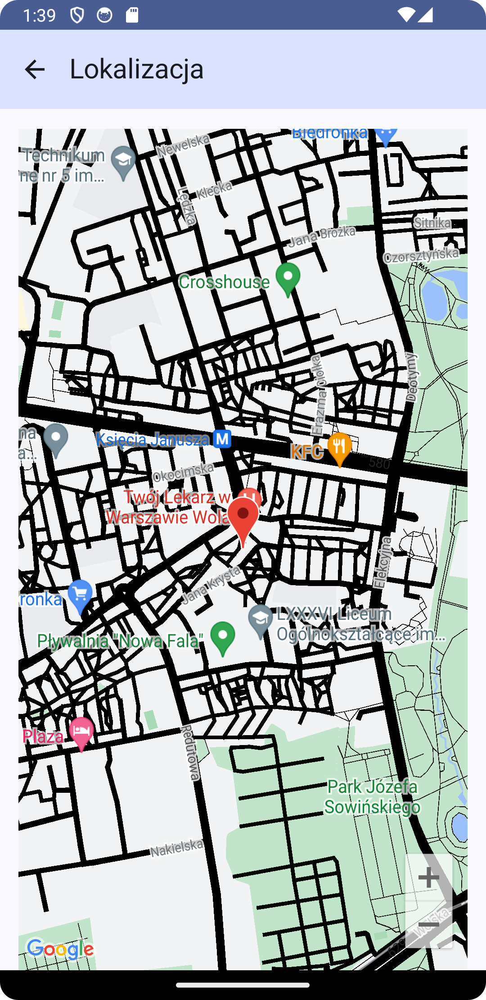
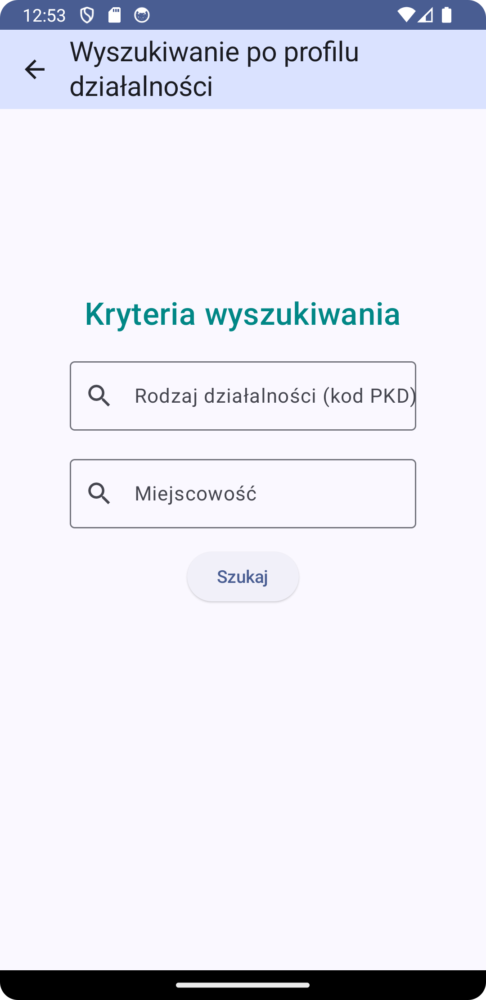
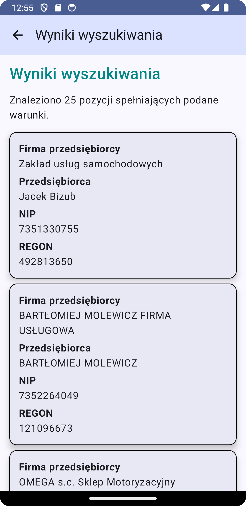
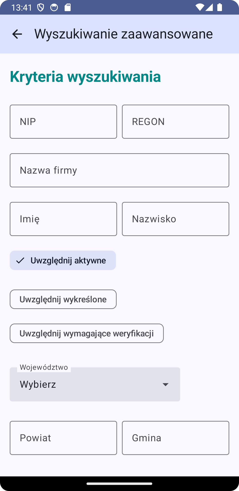

# CEiDG Search Application

### Summary
Find Polish companies by different criteria, such as Taxpayer\`s Identification Number (NIP), type of activity (PKD code), city...

### How to Use
This project required CEiDG API key, get for free [here](https://dane.biznes.gov.pl/).
Add `CEIDG_API_KEY="CEIDG_API_KEY"` into project `local.properties` file.
Also API key for Google Maps is required. Create API key [here](https://developers.google.com/maps/documentation/android-sdk/get-api-key)
Add `MAPS_API_KEY="GOOGLE_MAP_API_KEY"` into project `local.properties` file.

### Technology
This project was created with [Kotlin](https://kotlinlang.org/) and [Jetpack Compose UI](https://developer.android.com/develop/ui/compose).

### Screens

