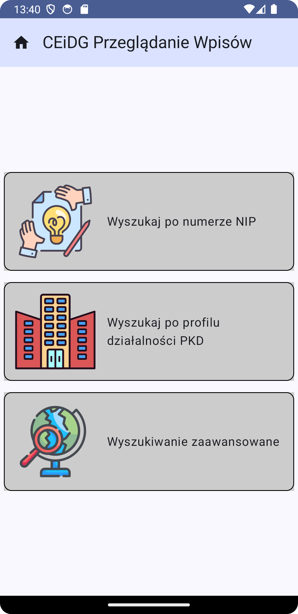

# CEiDG Search Application

### Summary
Find Polish company by Taxpayer\`s Identification Number (NIP), type of activity (PKD code) and city.

### How to Use
This project required API key, get for free [here](https://dane.biznes.gov.pl/).
Add `CEIDG_API_KEY="YOUR_API_KEY"` into project `local.properties` file.

### Technology
This project was created with [Kotlin](https://kotlinlang.org/) and [Jetpack Compose UI](https://developer.android.com/develop/ui/compose).

### Screens

